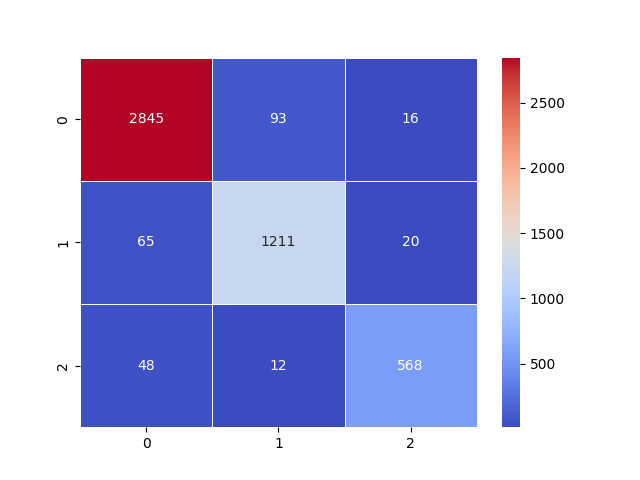

# LoraBERT
### Summary
**LoraBERT** is a fine-tuned model for **financial text sentiment analysis**, using **LoRA (Low-Rank Adaptation)** to optimize Huawei's TinyBERT. The model accurately classifies financial news and reports, distinguishing between positive, neutral, and negative sentiments with minimal computational cost.

#### Dataset used: [FinancialPhraseBank Dataset](https://www.researchgate.net/publication/251231364_FinancialPhraseBank-v10)
#### Results: Achieved 94.8% validation accuracy, surpassing the FinBERT benchmark of 94.5%.


## Demo
A Flask-based app has been developed for quick, local testing of LoraBERT’s capabilities. It supports:

1. **Text Input:** Directly analyze text sentiment.
2. **Image Input:** Extracts text using OCR and then performs sentiment analysis.
#### To Run the App Locally:
```bash
cd LoraBert
python app.py
```
Visit the provided **localhost** URL in your browser to interact with the app.

## Installation
Follow these steps to set up the environment and run the project:

1. **Create a virtual environment:**
```bash
python -m venv env
```
2. **Activate the virtual environment:**
```bash
# On Windows
env\Scripts\activate
# On macOS/Linux
source env/bin/activate
```
3. **Install dependencies:**
```bash
pip install -r requirements.txt
```
## Training Results
### Training Results with FinancialPhraseBank-v1.0 Dataset

The model was trained using the **FinancialPhraseBank-v1.0** dataset, with the following results across epochs:

| **Epoch** | **Train Loss** | **Validation Accuracy** |
|-----------|----------------|-------------------------|
| 1         | 0.458          | 88.8%                   |
| 2         | 0.275          | 93.2%                   |
| 3         | 0.128          | 94.3%                   |
| 4         | 0.056          | 94.8%                   |

Training was optimized using **LoRA fine-tuning** on the **TinyBERT_General_4L_312D** model, resulting in efficient performance with minimal additional storage requirements (~1MB).

### Evaluation

After training, the model was evaluated with the following setup:

#### Confusion Matrix:
The confusion matrix highlights the model's accuracy across different sentiment categories (positive, neutral, and negative).



#### Sample Predictions:

- **Text**: "Last year, 3 million passengers flew the airline, down 4 percent from 2007."  
  **Real Sentiment**: Negative  
  **Predicted Sentiment**: Negative

- **Text**: "The facility will have a lettable area of some 19,000 sq m. The plot for the plant, located in the ratamäki business park, will be purchased from the city of forssa."  
  **Real Sentiment**: Neutral  
  **Predicted Sentiment**: Neutral

- **Text**: "Reporting in accordance with the merged business operations will start as of January 1, 2011."  
  **Real Sentiment**: Neutral  
  **Predicted Sentiment**: Neutral

---

### Features

- **Sentiment Analysis**: Predicts positive, neutral, or negative sentiment with high accuracy for financial texts.
- **OCR Integration**: Extracts text from images for analysis.
- **LoRA Optimization**: Fine-tuned with LoRA, adding minimal extra parameters.
- **Deployment-Ready**: Flask app included for local hosting or cloud deployment.

---

### Workflow

1. **Configuration Setup**: Sets up device and other parameters for training.
2. **Data Loading**: Loads and preprocesses training and test datasets.
3. **Training Pipeline**: Runs training for multiple epochs and logs accuracy and loss.
4. **Evaluation Pipeline**: Evaluates on test data, saves model, and generates a confusion matrix.

### Future Work

#### Enhancements:
- Support for multi-language financial sentiment analysis.
- Integration with real-time financial data APIs (e.g., stock market news).

#### Deployment:
- Dockerize the app for scalability.
- Explore cloud hosting options (AWS, GCP, Azure).

---

### Acknowledgments

Special thanks to **Umar Jamil** for his **LoRA tutorial**.

- [LoRA Tutorial (YouTube)](https://www.youtube.com/watch?v=PXWYUTMt-AU&list=LL&index=8&t=6s)
- [LoRA Paper](https://arxiv.org/abs/2106.09685)

### License

This project is licensed under the **MIT License**.

---

### Contact

For questions or collaborations:

- **LinkedIn**: [Pratyaksh agarwal](https://www.linkedin.com/in/pratyaksh-agarwal-3673b7282/)
- **Email**: [pratyakshagarwal93@gmail.com](mailto:pratyakshagarwal93@gmail.com)

---

### AI Tools Used

AI tools were used to assist in writing the documentation and README files for this project.